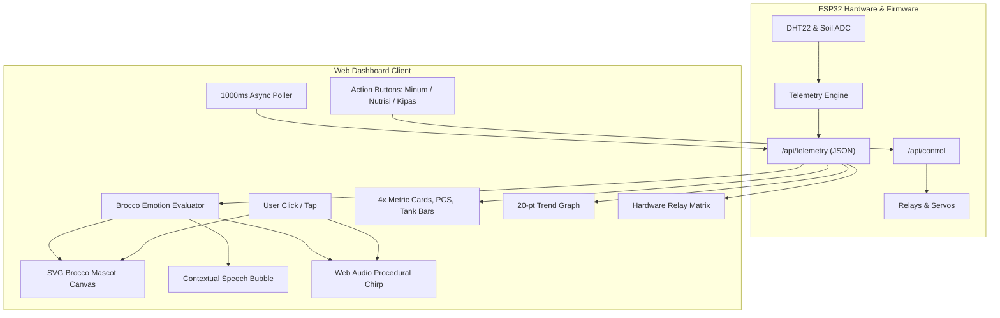
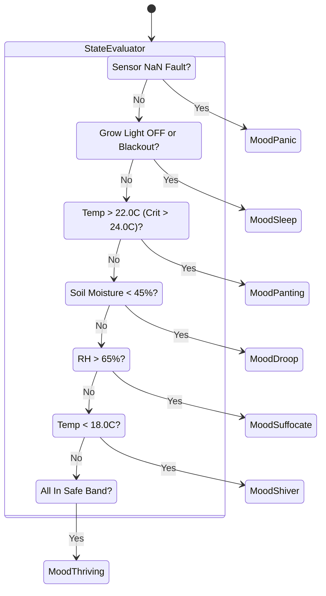

## Goal Capsule

- **Objective:** Transform the Broccoli Biosphere Cabin web dashboard into an engaging, gamified, virtual-pet-style interface (inspired by Talking Tom and Pou) featuring an animated Broccoli microgreen character ("Brocco") that dynamically reacts to real-time agronomic telemetry, while preserving all industrial-grade monitoring data, trend charts, actuator matrix, and manual/automated climate controls.
- **Means:** Pure inline SVG/CSS vector character animation engine, procedural Web Audio API sound synthesis (zero external media assets), real-time emotion state machine linked to telemetry thresholds, and responsive layout hierarchy integrated directly into the ESP32 PROGMEM single-file firmware (`BroccoliBiosphereCabin.ino`).
- **Authority Hierarchy:** User Request > Master Agronomic Specifications > Technical Plan.
- **Stop Conditions:** Brocco character renders responsively; facial expressions, gestures, and speech bubbles dynamically update based on `/api/telemetry`; pet actions ("Beri Minum", "Beri Nutrisi", "Kipas Semilir") successfully dispatch commands to `/api/control`; all existing engineering cards, SVG trend charts, relay states, and terminal logs remain functional without page reload.
- **Tail Ownership:** Standalone shipping workflow via `ce-work`.

---

## Product Contract

### Summary

The Broccoli Biosphere Cabin requires a high-performance web interface that blends industrial IoT telemetry with the playful, emotionally resonant interaction model of classic virtual pets (such as *Pou* and *Talking Tom*). The core avatar—a living Broccoli Microgreen named **Brocco**—acts as an intuitive visual health gauge. When climate parameters drift into hazardous ranges (e.g., Pythium root rot risk at $>24^\circ\text{C}$, desiccation at $<45\%$ soil moisture, or stagnant humidity boundary layers at $>65\%$ RH), Brocco immediately reflects stress through visual animations, reactive expressions, and contextual speech bubbles. Users can nurture Brocco via one-click pet actions that physically trigger the cabin's actuators (Tank 1 ultrasonic spray, Tank 2 nutrient booster, and DC blower).

### Problem Frame

Traditional IoT agriculture dashboards rely on numeric readouts, gauges, and status badges. While effective for trained agronomists, they create cognitive friction for general users, students, and operators monitoring plant wellness at a glance. By projecting complex multi-variable biological state (Tetens VPD, Plant Comfort Score, soil moisture, and thermal thresholds) onto an anthropomorphic microgreen character, users instantly intuit plant distress and corrective needs without decoding raw engineering figures—all while maintaining the full scientific instrumentation below the hero companion.

### Requirements

#### Character Architecture & Visual Identity
- R1. The web interface shall feature a scalable, lightweight vector mascot ("Brocco") rendered purely with inline SVG and CSS keyframes, requiring zero external raster images, 3D engines, or CDN dependencies.
- R2. The mascot shall maintain a Cyber-Agri aesthetic matching the dark glassmorphism theme (`#0a0e17`, mint `#00ff9d`, electric blue `#00b4d8`, amber `#ffb703`, and danger red `#ff0055`).

#### Telemetry-Driven Expression State Machine
- R3. The mascot shall dynamically switch between at least six discrete emotional and physiological states driven by real-time telemetry from `/api/telemetry`:
  - **Optimal / Thriving:** PCS $\ge 80\%$, Temp $18.0 - 22.0^\circ\text{C}$, RH $50 - 65\%$. Animation: cheerful eyes, smiling mouth, subtle rhythmic bouncing, sparkling green aura.
  - **Cold / Shivering:** Temp $< 18.0^\circ\text{C}$. Animation: rapid shivering wobble, blue-tinted shivering cheeks, icicle frost effect, chattering teeth.
  - **Heat Stress / Panting:** Temp $> 22.0^\circ\text{C}$ (Critical $> 24.0^\circ\text{C}$ Pythium warning). Animation: flushed reddish cap, sweating droplets, panting tongue, exhausted posture.
  - **Thirsty / Drooping:** Soil Moisture $< 45\%$. Animation: wilted stem, sad downward droop, teary eyes, dry soil icon.
  - **Over-Saturated / Sinking:** Soil Moisture $> 70\%$. Animation: floating water droplets, dizzy swirling eyes, bloated cheeks.
  - **Stagnant High Humidity / Suffocating:** RH $> 65\%$ (awaiting or triggering blower purge). Animation: hazy mist surrounding character, fanning itself, wavy dizzy expression.
  - **Blackout Sleep / Night Cycle:** Germination Phase or 8-hour dark cycle (Grow Light OFF). Animation: closed sleeping eyes, floating animated `Zzz` bubbles, peaceful breathing pulse.

#### User Interaction & Dialogue System
- R4. Clicking or tapping on the mascot shall trigger an interactive response: a springy bounce animation, a contextual speech bubble in Indonesian conveying current sensations and agronomic status (e.g., *"Sejuk dan nyaman! PCS kita 95%!"*, *"Aduh panas! Turunkan suhu di bawah 22°C!"*), and an optional cute synthesized chirp.
- R5. The interface shall provide three quick-action pet nurture buttons directly adjacent to Brocco:
  - **"Beri Minum" (Hydrate):** Triggers a 5-second ultrasonic mist pulse from Tank 1 (Demineralized Water) via `/api/control?action=flush` or `/api/control?action=toggleRelay&ch=5`.
  - **"Beri Vitamin" (Nutrient Boost):** Triggers a 5-second ultrasonic pulse from Tank 2 (Micro Nutrients) via `/api/control?action=toggleRelay&ch=6`.
  - **"Kipas Semilir" (Gentle Breeze):** Toggles or pulses the DC Blower (CH3) to break the humid stagnant boundary layer.

#### Audio & Feedback
- R6. Audio feedback shall be generated procedurally via the browser's native Web Audio API (oscillators and gain envelopes) producing cute 8-bit game-style chirps and pops, with an on-screen mute/sound toggle button. Zero external audio files (`.mp3`/`.wav`) shall be requested over the network.

#### Telemetry Preservation & Layout Integrity
- R7. The integration of Brocco shall not degrade or remove any existing engineering instrument:
  - The 4 Primary Telemetry Cards (Temp, RH, Soil, VPD) with dynamic status badges (`OPTIMAL`, `WASPADA`, `KRITIS`) must remain prominently visible.
  - The Plant Comfort Score (PCS) meter, Dual-Tank reservoir volume bars, and Growth Phase Sequencer must remain functional.
  - The 6-Channel Relay & Valve Matrix, real-time SVG 20-point trend chart, interactive control panel (Auto/Manual mode, Day stepper, Refill buttons), and system event terminal must remain fully operational.
- R8. The layout shall be responsive: on mobile viewports ($< 768\text{px}$), Brocco and its speech bubble shall sit in a compact, delightful hero card above the telemetry grid without pushing critical controls out of easy reach.

### Key Decisions

- **KD1 (session-settled: user-directed):** Adopt a Talking Tom / Pou virtual-pet interaction paradigm featuring a live animated broccoli microgreen avatar rather than purely statistical dashboards.
- **KD2 (session-settled: user-directed):** Integrate the mascot directly into the hero section alongside telemetry cards in a unified responsive layout, rather than hiding engineering instrumentation behind a separate tab.
- **KD3:** Author all visual and audio assets in pure inline SVG, CSS3 animations, and Web Audio API synthesizer code within `BroccoliBiosphereCabin.ino` to guarantee 100% offline operation and zero external network latency on local ESP32 Wi-Fi networks.

### Actors

- **A1. Biosphere Caretaker / Operator:** Interacts with the web dashboard via mobile phone, tablet, or desktop browser on the local Wi-Fi network to check plant wellbeing and trigger manual overrides or pet actions.
- **A2. Automated Supervisory Controller:** ESP32 background tasks managing closed-loop climate regulation, anti-fungal purge cycles, and safety interlocks.

### Key Flows

- **F1. Real-Time Mood Synchronization:**
  1. Browser executes asynchronous `fetch('/api/telemetry')` every 1000 ms.
  2. JSON payload parsed into local variables.
  3. Mascot Emotion Controller computes state priority:
     - Check Critical Sensor Fault $\to$ Panic/Error expression.
     - Check Sleep Cycle (Light OFF) $\to$ Sleeping `Zzz` expression.
     - Check Severe Heat ($T > 22^\circ\text{C}$) $\to$ Panting / Sweating.
     - Check High Humidity ($RH > 65\%$) $\to$ Stagnant / Fanning.
     - Check Dry Soil ($Moisture < 45\%$) $\to$ Drooping / Thirsty.
     - Check Low Temp ($T < 18^\circ\text{C}$) $\to$ Shivering.
     - Default (all within bounds) $\to$ Happy / Thriving.
  4. SVG classes and facial elements (eyes, mouth, sweat, sparkles, posture) transition smoothly via CSS transforms.
  5. Speech bubble text updates with helpful, contextual commentary.

- **F2. Interactive Nurture Action:**
  1. User taps "Beri Minum" or "Beri Vitamin".
  2. Brocco plays a happy drinking/gulping animation with a sound chirp.
  3. Browser dispatches `POST /api/control` to activate designated spray line.
  4. Physical servo opens to $90^\circ$, ultrasonic relay fires.
  5. Dashboard shows actuator active in Hardware Matrix and updates speech bubble: *"Ah segar! Air baku disemprotkan!"*.

### Scope Boundaries

#### In Scope
- Designing and embedding a complete inline vector SVG Brocco mascot with articulated parts (body cap, florets, eyes, mouth, cheeks, sweat drops, icicles, zzz bubbles).
- CSS animation keyframes for idle breathing, shivering, panting, bouncing, sleeping, and drinking.
- JavaScript state evaluator mapping telemetry fields (`temp`, `rh`, `soil`, `vpd`, `pcs`, `phase`, `relays.light`) to mood classes.
- Dynamic dialogue generator in Indonesian producing contextual status remarks.
- Web Audio API synthesizer for tap sound effects and action chimes.
- Pet quick-action buttons linked to existing `/api/control` endpoints.
- Mute/Unmute audio toggle switch with `localStorage` persistence.
- Layout integration into `BroccoliBiosphereCabin.ino` maintaining 100% telemetry fidelity.

#### Deferred to Follow-Up Work
- Custom accessories/costumes for Brocco (e.g., hats or sunglasses unlocked as cultivation days advance).
- Voice recognition or microphone mimicry (pure Talking Tom audio pitch shift requires client-side WebRTC audio processing buffers, deferred to future expansion).
- Long-term hunger/happiness decay meters separate from actual physical sensor readings.

#### Outside This Product's Identity
- External cloud pet accounts or social sharing APIs (system is strictly self-contained on ESP32 local LAN).
- Heavy 3D WebGL meshes or Three.js dependencies (unsuitable for low-power microcontroller flash).

---

## Planning Contract

### Key Technical Decisions

- **KTD1. Inline SVG with Morphing Elements over Canvas/GIF:**  
  *Rationale:* Inline SVG elements are DOM nodes that can be manipulated and animated using pure CSS (`transform`, `opacity`, `fill`). They scale crisply to any screen resolution (retina mobile to 4K monitor), take $<12\text{ KB}$ of text in PROGMEM, and produce zero memory leaks compared to continuous Canvas redraw loops.
- **KTD2. Web Audio API Procedural Synthesizer:**  
  *Rationale:* Storing `.mp3` or `.wav` audio files in ESP32 flash memory would consume hundreds of kilobytes and require base64 chunking or SPIFFS/LittleFS partitions. Procedural synthesis using `AudioContext`, `OscillatorNode`, and `GainNode` creates charming, dynamic 8-bit sound effects in $<50$ lines of JavaScript with zero storage footprint.
- **KTD3. Monolithic PROGMEM String Delivery:**  
  *Rationale:* Retain the proven single-file `.ino` architecture of `BroccoliBiosphereCabin.ino`. All CSS, SVG, and JavaScript for Brocco will be seamlessly integrated into `INDEX_HTML[] PROGMEM`, ensuring no multi-file build steps, zero SPIFFS dependencies, and instantaneous single-round-trip HTTP delivery.
- **KTD4. Priority-Weighted Emotion State Evaluator:**  
  *Rationale:* Multiple telemetry variables can be sub-optimal simultaneously (e.g., both temperature and humidity high). The state evaluator must use an explicit priority cascade: Critical Pythium Heat Risk ($>24^\circ\text{C}$) $\to$ Severe Desiccation ($<35\%$) $\to$ Normal Stress $\to$ Sleep $\to$ Happy, preventing visual stutter or flickering between states.
- **KTD5. Cohesive Cyber-Agri Glassmorphic Placement:**  
  *Rationale:* Brocco will reside in a dedicated Hero Companion Card positioned at the top of the dashboard (flex-wrap layout), immediately next to the Primary Status and Quick Controls, establishing immediate emotional rapport before the user scrolls to detailed engineering graphs and logs.

### High-Level Technical Design



#### Mascot Visual State Hierarchy



### Assumptions

- The ESP32 program flash memory has sufficient headroom for an additional $\approx 15\text{ KB}$ of compressed HTML/SVG/JS in PROGMEM (current sketch size is $\approx 65\text{ KB}$, well within ESP32 1.2MB-3MB app partition).
- The client device browser supports modern CSS animations (`@keyframes`), SVG rendering, and Web Audio API (supported by Chrome, Safari, Edge, and Firefox on mobile and desktop since 2016).
- The user operates the dashboard on a modern browser that permits Web Audio playback following the first user click/touch interaction (standard browser autoplay policy).

---

## Implementation Units

### U1. Vector Mascot Component & CSS Expression Engine

- **Goal:** Design and construct the complete inline SVG Broccoli Mascot ("Brocco") and its corresponding CSS animation styles within the web dashboard.
- **Requirements:** R1, R2, R3.
- **Dependencies:** None.
- **Files:** `BroccoliBiosphereCabin.ino`
- **Approach:**
  1. Define SVG structure for Brocco with grouped elements:
     - `#brocco-body`: Stem base with organic curved contour.
     - `#brocco-crown`: Triple floret broccoli crown with emerald gradient shading (`#00ff9d` to `#059669`).
     - `#brocco-eyes`: Expressive cartoon eyes (pupils, highlights, blink lids).
     - `#brocco-mouth`: Dynamic mouth path (happy smile, panting open mouth, shivering squiggly line, drooping sad curve).
     - `#brocco-cheeks`: Blushing glowing cheeks (`rgba(0, 255, 157, 0.4)` turning red `#ff0055` during heat).
     - `#brocco-props`: Sweat drops, shivering icicles, floating `Zzz` sleep glyphs, and hydration sparkles.
  2. Implement CSS animation keyframes:
     - `@keyframes brocco-idle`: Gentle breathing squish and stretch ($2\text{s}$ ease-in-out infinite).
     - `@keyframes brocco-shiver`: Rapid horizontal oscillation ($0.15\text{s}$ infinite).
     - `@keyframes brocco-pant`: Heavy vertical panting with tongue animation ($0.5\text{s}$ infinite).
     - `@keyframes brocco-droop`: Slow downward head angle ($3\text{s}$ loop).
     - `@keyframes brocco-bounce`: Springy jump on click ($0.4\text{s}$ cubic-bezier).
     - `@keyframes float-zzz`: Floating upward sleep bubble with opacity fade.
- **Patterns to follow:** Existing dark glassmorphic styling in `BroccoliBiosphereCabin.ino` (`var(--neon-mint)`, `var(--card-bg)`, `backdrop-filter`).
- **Test Scenarios:**
  - *Happy path:* Brocco SVG displays cleanly with correct proportions, vibrant neon highlights, and smooth idle breathing animation on desktop and mobile viewports.
  - *Class toggle verification:* Adding CSS classes (`.mood-shiver`, `.mood-pant`, `.mood-thirsty`, `.mood-sleep`) shifts facial features, mouth curvature, and accessories smoothly without tearing or layout shifts.
- **Verification:** Brocco renders without visual artifacting and responds immediately to CSS class modifications.

### U2. Real-Time Telemetry-to-Emotion State Mapper & Speech Bubble Engine

- **Goal:** Implement the JavaScript logic that interprets `/api/telemetry` values, drives Brocco's mood state transitions, and renders dynamic speech bubbles.
- **Requirements:** R3, R4, R7.
- **Dependencies:** U1.
- **Files:** `BroccoliBiosphereCabin.ino`
- **Approach:**
  1. Construct `updateBroccoMood(telemetry)` JavaScript function invoked inside the 1000ms polling cycle.
  2. Evaluate priority cascade:
     - Fault condition (`status === 'SAFEMODE'`): Panicked mood, speech bubble: *"Sensor bermasalah! Sistem masuk Safe Mode!"*.
     - Sleep condition (`relays.light === false`): Sleeping mood, speech bubble: *"Zzz... Sedang siklus gelap/istirahat..."*.
     - Severe heat ($T > 24.0^\circ\text{C}$): Critical panting, speech bubble: *"Panas sekali! Awas bahaya busuk akar Pythium!"*.
     - Warning heat ($T > 22.0^\circ\text{C}$): Mild heat stress, speech bubble: *"Agak gerah nih, aktifkan pendingin Peltier!"*.
     - Cold stress ($T < 18.0^\circ\text{C}$): Shivering mood, speech bubble: *"Brrr menggigil! Suhu di bawah 18°C!"*.
     - High humidity ($RH > 65.0\%$): Stagnant mood, speech bubble: *"Udara terlalu lembap, daun butuh hembusan blower!"*.
     - Dry soil ($Soil < 45.0\%$): Drooping mood, speech bubble: *"Tanahku kering kerontang, butuh semprotan air!"*.
     - Optimal ($PCS \ge 80\%$): Joyful mood, speech bubble: *"Kondisi biosfer prima! Tumbuh optimal!"*.
  3. Render speech bubble element with glassmorphic container, animated typing or fade effect, and tail pointing toward Brocco's head.
- **Patterns to follow:** Existing `renderDashboard(data)` function inside `BroccoliBiosphereCabin.ino`.
- **Test Scenarios:**
  - *Temperature high trigger:* Simulated temperature of $24.5^\circ\text{C}$ immediately triggers `.mood-pant` and displays the Pythium warning speech bubble.
  - *Soil moisture low trigger:* Simulated soil moisture of $38\%$ triggers `.mood-thirsty` and displays hydration request.
  - *Rapid state stability:* Oscillating sensor values do not cause erratic speech bubble text flickering (debounced or state-locked for at least 3 seconds).
- **Verification:** Unit test script feeding synthetic telemetry objects demonstrates correct mood classification for all permutations.

### U3. Interactive Actuator Action Handlers & Web Audio Sound Synthesizer

- **Goal:** Build the interactive gesture handlers (tap/click reactions), action nurture buttons ("Beri Minum", "Beri Vitamin", "Kipas Semilir"), and zero-dependency procedural sound synthesizer.
- **Requirements:** R4, R5, R6.
- **Dependencies:** U1, U2.
- **Files:** `BroccoliBiosphereCabin.ino`
- **Approach:**
  1. Implement Web Audio API sound generator `playChirp(type)`:
     - `AudioContext` initialized on first user interaction to satisfy browser autoplay security.
     - `happy-tap`: Short ascending frequency sweep (sine wave $440\text{Hz} \to 880\text{Hz}$, $0.15\text{s}$).
     - `drink-water`: Bubbly cascading tones ($600\text{Hz} \to 300\text{Hz}$, $0.2\text{s}$).
     - `breeze-fan`: Filtered white noise or soft low-frequency modulation ($0.3\text{s}$).
     - `alert`: Dual-beep staccato ($800\text{Hz}$, $0.1\text{s} \times 2$).
  2. Implement on-screen Audio Mute toggle button (`[🔊 SFX: ON/OFF]`) saving preference to `localStorage`.
  3. Wire tap listener on `#brocco-mascot`:
     - Plays bounce animation.
     - Plays `happy-tap` sound.
     - Shows spontaneous fun remarks (e.g., *"Hehe geli!", "Ayo rawat aku!", "Biosfer aman terkendali!"*).
  4. Wire Action Buttons:
     - **Beri Minum Button:** Calls `sendControl('action=flush')` (5s Tank 1 spray), triggers gulping animation, plays water sound.
     - **Beri Vitamin Button:** Calls `sendControl('action=toggleRelay&ch=6')` or dedicated 5s pulse endpoint, triggers energetic glow.
     - **Kipas Semilir Button:** Calls `sendControl('action=toggleRelay&ch=3')` (Blower CH3), triggers windy animation.
- **Patterns to follow:** Existing `sendControl(queryString)` API dispatcher in `BroccoliBiosphereCabin.ino`.
- **Test Scenarios:**
  - *Tap interaction:* Clicking Brocco triggers bounce animation and updates speech bubble.
  - *Action dispatch:* Clicking "Beri Minum" sends POST request to `/api/control?action=flush` without reloading the page.
  - *Audio mute:* When muted, no sound plays; unmuting restores audio without console errors.
- **Verification:** Action buttons successfully dispatch network commands and visual/audio feedback fires correctly.

### U4. Responsive Layout Integration & Dual-View / Telemetry Preservation

- **Goal:** Integrate Brocco, the speech bubble, and quick-action buttons into the dashboard header/hero section while preserving full visual hierarchy and unobstructed visibility of all engineering telemetry.
- **Requirements:** R7, R8.
- **Dependencies:** U1, U2, U3.
- **Files:** `BroccoliBiosphereCabin.ino`
- **Approach:**
  1. Create a modern "Hero Companion Grid" at the top of the body:
     - Left / Center Panel: Brocco Mascot card, speech bubble, and the 3 pet nurture action buttons.
     - Right Panel: Global Biosphere Status, IP, Uptime, and Quick Mode toggles.
  2. Retain all sections below hero without alteration:
     - 4x Telemetry Cards (Temp, RH, Soil, VPD).
     - Instruments Grid (PCS, Dual-Tank Levels, Growth Sequencer).
     - 6-Channel Hardware Relay Matrix with status LEDs and valve angles.
     - Real-Time 20-point SVG Trend Chart.
     - Bilateral Command & Operational Controls panel.
     - Mini Terminal Event Console.
  3. Ensure responsive flex/grid layouts:
     - Desktop ($>1024\text{px}$): Brocco companion card comfortably sized ($320\text{px}$ width) beside status headers.
     - Tablet / Mobile ($<768\text{px}$): Brocco card stacks gracefully above telemetry cards, auto-scaling SVG dimensions.
- **Patterns to follow:** Existing CSS flexbox and grid styling in `INDEX_HTML`.
- **Test Scenarios:**
  - *Desktop layout:* Brocco sits beside header metrics; no horizontal scrollbar appears.
  - *Mobile layout ($375\text{px}$ iPhone view):* Mascot scales smoothly, speech bubble text wraps properly, all 4 telemetry cards stack legibly below.
  - *Full instrumentation intact:* All existing metrics (Temp, RH, Soil, VPD, PCS, Relays, Charts) update dynamically every 1000ms.
- **Verification:** Visual layout inspection across simulated viewport widths ($375\text{px}$, $768\text{px}$, $1440\text{px}$).

### U5. End-to-End Firmware Verification, Memory Footprint & Functional Tests

- **Goal:** Verify that the updated `BroccoliBiosphereCabin.ino` compiles cleanly, stays within ESP32 flash constraints, and executes non-blocking loops with zero runtime latency.
- **Requirements:** R1-R8.
- **Dependencies:** U1, U2, U3, U4.
- **Files:** `BroccoliBiosphereCabin.ino`
- **Approach:**
  1. Verify total source code size and PROGMEM payload length ($<100\text{ KB}$, leaving $>90\%$ of flash free).
  2. Run Node.js / Bun script to validate embedded HTML, CSS syntax, SVG tag closures, and JavaScript syntax inside `INDEX_HTML`.
  3. Run C++ simulation / syntax check to guarantee non-blocking `millis()` architecture remains intact and relay/interlock safety logic is uncompromised.
- **Test Scenarios:**
  - *Syntax validation:* HTML/JS parser confirms zero unclosed tags, valid JSON formatting, and correct endpoint calls.
  - *C++ compilation:* Code passes C++ validation with zero errors and zero warnings.
- **Verification:** Validation scripts exit with code 0.

---

## Verification Contract

### Test Commands

1. **HTML & Client JavaScript Syntax Verification:**
   ```bash
   node -e "
     const fs = require('fs');
     const code = fs.readFileSync('BroccoliBiosphereCabin.ino', 'utf8');
     const start = code.indexOf('const char INDEX_HTML[] PROGMEM = R\"rawliteral(');
     const end = code.indexOf(')rawliteral\";');
     if (start === -1 || end === -1) throw new Error('Raw literal markers missing');
     const html = code.substring(start + 47, end);
     console.log('Extracted HTML size:', html.length, 'bytes');
     // Validate presence of mascot elements
     const checks = ['brocco-mascot', 'brocco-bubble', 'updateBroccoMood', 'playChirp', 'btnBeriMinum'];
     for (const c of checks) {
       if (!html.includes(c)) throw new Error('Missing mascot element: ' + c);
     }
     console.log('All Brocco mascot elements validated successfully!');
   "
   ```

2. **C++ Structural & Interlock Logic Verification:**
   - Execute verification suite checking that `BroccoliBiosphereCabin.ino` maintains the non-blocking execution loop, Peltier-Fan thermal safety interlocks, and anti-mix valve logic.

---

## Definition of Done

- [ ] Inline SVG Brocco mascot and CSS keyframe animations implemented cleanly in `INDEX_HTML`.
- [ ] Real-time emotion state machine evaluates telemetry every 1000 ms and transitions smoothly between Optimal, Cold, Heat, Thirsty, Stagnant, and Sleep states.
- [ ] Speech bubble renders contextual Indonesian remarks matching current agronomic health and alerts.
- [ ] Tap interaction triggers bounce animation and vocalization.
- [ ] Three quick-action nurture buttons ("Beri Minum", "Beri Vitamin", "Kipas Semilir") successfully dispatch commands to `/api/control`.
- [ ] Web Audio API procedural sound synthesizer plays chirps with a working on/off mute toggle.
- [ ] All existing telemetry instruments (4 primary cards, PCS gauge, dual tank levels, growth sequencer, 6-ch relay matrix, SVG trend chart, terminal console) remain fully visible and operational.
- [ ] Firmware file `BroccoliBiosphereCabin.ino` compiles with zero syntax errors, zero placeholder comments, and strict non-blocking `millis()` execution.
