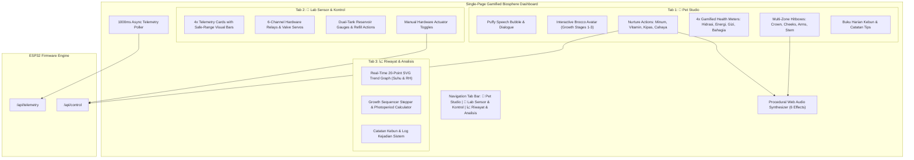
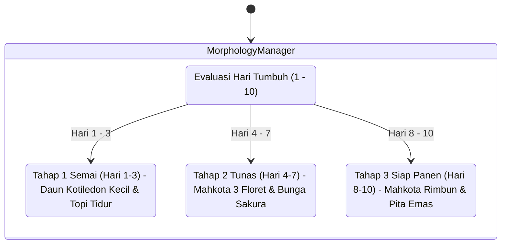

## Goal Capsule

- **Objective:** Fully revamp the Broccoli Biosphere Cabin web interface into a rich, gamified virtual pet studio centered on an animated Broccoli Microgreen avatar ("Brocco") that grows dynamically over the 10-day cultivation cycle, reacts to multi-zone touch gestures, emits procedural 8-bit audio effects, and translates physical environmental telemetry into gamified plant care mechanics, while keeping all scientific instrumentation and hardware controls cleanly accessible.
- **Means:** Multi-stage vector SVG growth morphology engine (Baby Sprout $\to$ Active Microgreen $\to$ Harvest Master), multi-zone interactive hit-boxes on SVG body parts, procedural Web Audio API soundboard (6 synthesized chimes and vocalizations), gamified biometric care meters (Hydration, Photosynthesis Energy, Nutrient Saturation, Thermal Comfort), and a clean tabbed view switcher ("Pet Studio", "Lab Kontrol", "Analisis & Log") embedded in the ESP32 PROGMEM single-file firmware (`BroccoliBiosphereCabin.ino`).
- **Authority Hierarchy:** User Selection (Maximized Gamification) > Master Agronomic Specifications > Technical Plan.
- **Stop Conditions:** Brocco avatar scales dynamically based on day counter (Days 1-3 baby sprout, Days 4-7 young microgreen, Days 8-10 lush harvest); clicking different body zones (crown, cheeks, arms, stem) triggers distinctive animations and audio chirps; pet nurture actions trigger physical actuators via `/api/control`; tabbed view switcher allows seamless switching between Pet Studio, Full Hardware Controls, and Trend Analytics without page reload or memory leaks.
- **Tail Ownership:** Standalone shipping workflow via `ce-work`.

---

## Product Contract

### Summary

The Broccoli Biosphere Cabin interface is revamped from a standard monitoring dashboard into an immersive, cozy virtual pet simulation inspired by *Tamagotchi*, *Pou*, and *Animal Crossing*, built specifically for microgreen cultivation. Rather than viewing isolated sensor numbers, users raise "Brocco"—a living broccoli microgreen pet whose physical health, mood, and visual age directly reflect real-world cabin conditions.

Users nurture Brocco through playful daily interactions: watering with pure Tank 1 mist, feeding Tank 2 chelated micronutrients, turning on breeze fans to clear stagnant humidity, and managing the 16-hour light cycle. As cultivation advances from germination to harvest, Brocco physically evolves from a tiny sleeping sprout into a lush, crowned microgreen ready for harvesting. Behind this playful exterior lies a full industrial agronomic laboratory: scientific charts, 6-channel relay statuses, and closed-loop climate controls remain accessible with one tap.

### Problem Frame

While the previous dashboard successfully introduced character elements, its layout separated related controls from the avatar and treated the virtual pet as a decorative hero card above standard telemetry rows. For genuine engagement, the virtual pet experience must be deeply gamified: the plant's morphological stage must reflect its true cultivation day, touching different body parts must produce responsive feedback, care actions must visibly replenish gamified biometric meters, and the layout must allow users to immerse in the "Pet Studio" without visual clutter, while retaining instant access to the full "Engineering & Lab" controls.

### Requirements

#### Brocco Morphological Evolution & Visual States
- R1. Brocco's SVG avatar shall feature three distinct developmental growth stages dictated by the cultivation day counter:
  - **Stage 1 (Baby Sprout, Days 1–3):** Tiny sprout stem, cute rounded cotyledon seed-leaves, sleeping nightcap or sleepy closed eyes, curled little leaf arms.
  - **Stage 2 (Young Microgreen, Days 4–7):** Active growing microgreen with triple-floret crown, cherry blossom flower pin, expressive anime eyes, and playful waving leaf hands.
  - **Stage 3 (Harvest-Ready Master, Days 8–10):** Lush dense emerald crown, proud standing posture, sparkling harvest ribbon/crown, glowing golden aura.
- R2. The avatar shall maintain real-time reactive moods driven by environmental thresholds:
  - **Optimal (PCS $\ge 85\%$):** Radiant cheeks, sparkling stars, happy breathing bounce.
  - **Cold Stress ($T < 18.0^\circ\text{C}$):** Rapid shivering oscillation, blue cheeks, icicles hanging from florets.
  - **Heat Stress ($T > 22.0^\circ\text{C}$, Crit $> 24.0^\circ\text{C}$):** Panting tongue, rosy red cheeks, dripping sweat beads, emergency Pythium alert dialogue.
  - **Thirst ($Soil < 45\%$):** Head droop, teary watery eyes, wilted stem posture.
  - **Suffocating Humidity ($RH > 65\%$):** Fanning gesture, dizzy spiral eyes, requesting blower breeze.
  - **Night Rest (Light OFF):** Peaceful closed eyes, floating animated `Zzz` bubbles, breathing pulse.

#### Multi-Zone Interactive Touch System
- R3. The SVG avatar shall contain distinct interactive touch/click hit-boxes:
  - **Crown / Florets:** Jiggle squish animation (`@keyframes floret-jiggle`) with a playful high-frequency giggle chime.
  - **Cheeks:** Heart-burst particle animation (`@keyframes heart-burst`) with cute blushing squeak.
  - **Leaf Arms:** High-five waving animation with pleasant greeting chime.
  - **Stem / Feet:** Springy hop jump (`@keyframes brocco-hop`) with boing sound.
- R4. Each touch interaction shall update the speech bubble with contextual, endearing dialogue in Indonesian (e.g., *"Hehe geli! Terima kasih sudah mengelusku! 🌸"*, *"Ayo rawat aku sampai panen hari ke-10 ya! 🌱"*).

#### Procedural Web Audio Soundboard
- R5. The interface shall expand procedural audio synthesis via the browser's native Web Audio API (zero external `.mp3` downloads) to support 6 distinct synthesized effects:
  - `pet_giggle`: Ascending playful sine arpeggio ($587\text{Hz} \to 880\text{Hz}$).
  - `feed_water`: Bubbly cascading water drop tone ($400\text{Hz} \to 1046\text{Hz}$).
  - `feed_vitamin`: Sparkly 8-bit power-up chord ($523\text{Hz} \to 659\text{Hz} \to 783\text{Hz} \to 1046\text{Hz}$).
  - `breeze_fan`: Filtered soft wind rustle sweep ($329\text{Hz} \to 164\text{Hz}$).
  - `sleep_lullaby`: Gentle music-box lullaby tone ($440\text{Hz} \to 392\text{Hz} \to 349\text{Hz}$).
  - `alarm_beep`: Gentle dual warning tone for critical telemetry drifts ($880\text{Hz} \times 2$).
- R6. An on-screen sound toggle (`🎵 Musik: Nyala / 🔇 Musik: Mati`) shall persist mute preferences in `localStorage`.

#### Gamified Care Meters & Actuator Nurturing
- R7. The Pet Studio view shall display 4 gamified plant care health bars bound to physical telemetry:
  - **Level Hidrasi (Hydration Level):** Maps directly from Soil Moisture ($45-70\%$). Shows water drop icon, percentage, and status pill.
  - **Energi Cahaya (Light Energy):** Maps from Photoperiod state (Active when Grow Light CH4 is ON).
  - **Nutrisi Tanaman (Nutrient Saturation):** Tracks nutrient booster absorption with progress decay.
  - **Kebahagiaan Total (Overall Happiness):** Directly mirrors Plant Comfort Score (PCS $0-100\%$).
- R8. Nurture action buttons shall dispatch physical commands to `/api/control`:
  - **"🌸 Beri Minum":** Triggers 5-second ultrasonic spray from Tank 1, plays water sound, refills hydration meter.
  - **"✨ Beri Vitamin":** Triggers Tank 2 nutrient booster spray, plays level-up chime, refills nutrient meter.
  - **"🍃 Kipas Semilir":** Toggles DC Blower (CH3), plays wind sound, clears stagnant humidity.
  - **"💡 Atur Lampu":** Toggles Full-Spectrum LED Grow Light (CH4).

#### Information Architecture & View Navigation
- R9. The interface shall feature a clean 3-tab navigation bar at the top of the content area:
  - **Tab 1: 🌸 Pet Studio:** Brocco avatar stage, speech bubble, gamified care meters, nurture action buttons, and daily garden diary.
  - **Tab 2: 🧪 Lab Sensor & Kontrol:** 4 detailed telemetry cards with visual target range bars, hardware relay matrix with LED indicators, dual tank reservoir levels with refill buttons, and manual override switches.
  - **Tab 3: 📈 Riwayat & Analisis:** 20-point SVG real-time trend chart (Temp and RH curves), system event log terminal, and cultivation cycle progression stepper.
- R10. Tab switching shall be instantaneous (zero page reload), maintaining all WebSocket/polling timers and persistent audio contexts uninterrupted.

### Key Decisions

- **KD1 (session-settled: user-directed):** Maximize gamification and virtual pet mechanics as the primary user experience, elevating Brocco from a decorative avatar into an interactive plant companion with developmental growth stages and multi-zone touch gestures.
- **KD2 (session-settled: user-directed):** Implement a Tabbed Multi-View architecture ("Pet Studio", "Lab Kontrol", "Riwayat & Analisis") to eliminate long scrolling on mobile and desktop, allowing users to focus entirely on pet nurturing while keeping deep scientific controls one tap away.
- **KD3:** Retain 100% single-file firmware delivery in `BroccoliBiosphereCabin.ino` (`INDEX_HTML[] PROGMEM`) with zero external image assets, zero external audio files, and zero runtime dependencies.
- **KD4:** Maintain full backward compatibility with ESP32 REST API endpoints (`/api/telemetry` and `/api/control`).

### Actors

- **A1. Plant Caretaker / Casual User:** Interacts primarily through "Pet Studio" to check Brocco's happiness, pet the avatar, and trigger hydration/nutrition nurture actions.
- **A2. Agronomist / Technician:** Uses "Lab Sensor & Kontrol" and "Riwayat & Analisis" for deep diagnostic monitoring, sensor calibration verification, and manual actuator overrides.
- **A3. ESP32 Autonomous Controller:** Executes non-blocking closed-loop thermal regulation, anti-fungal blower purge cycles, and safety interlocks.

### Key Flows

- **F1. Multi-Zone Touch Interaction:**
  1. User taps Brocco's crown, cheek, leaf-arm, or stem.
  2. Hit-box event triggers targeted CSS animation (`@keyframes floret-jiggle`, `@keyframes heart-burst`, or `@keyframes brocco-hop`).
  3. Web Audio API synthesizes zone-specific sound effect (giggle, squeak, chime, or boing).
  4. Speech bubble displays playful, randomized Indonesian dialogue.

- **F2. Developmental Growth Stage Transition:**
  1. 1000ms telemetry poll receives updated `day` counter from ESP32.
  2. If `day <= 3`, avatar renders Sprout morphology with baby cotyledon leaves and sleepy cap.
  3. If `day >= 4 && day <= 7`, avatar renders Young Microgreen morphology with flower pin.
  4. If `day >= 8`, avatar renders Harvest Master morphology with sparkling ribbon.

- **F3. One-Touch Nurture Action:**
  1. User clicks "🌸 Beri Minum" in Pet Studio.
  2. Browser plays gulping audio chirp and triggers drinking animation on Brocco.
  3. Speech bubble updates: *"Aah, segaar! Semprotan air baku aktif! 💧✨"*.
  4. `POST /api/control?action=flush` dispatches to ESP32.
  5. Physical Tank 1 servo opens to $90^\circ$ and ultrasonic mist relay fires for 5 seconds.
  6. Hydration care meter visibly animates to $100\%$.

- **F4. Tab Navigation Switch:**
  1. User taps "🧪 Lab Sensor & Kontrol" in top tab bar.
  2. Pet Studio fades out smoothly ($0.15\text{s}$ opacity transition).
  3. Lab Control panel renders immediately, displaying 4 detailed sensor cards with visual optimal-band range bars, 6-channel relay matrix, and tank gauges.
  4. No network requests dispatched; telemetry poller continues running seamlessly.

### Scope Boundaries

#### In Scope
- Expanding the SVG Brocco vector definition to support 3 growth stage variations (Sprout, Microgreen, Harvest).
- Adding multi-zone SVG hit-boxes (`#zone-crown`, `#zone-cheeks`, `#zone-arms`, `#zone-stem`) with dedicated click listeners.
- Enhancing the Web Audio API soundboard with 6 distinct procedural chimes and sound effects.
- Implementing 4 gamified plant care health bars (Hydration, Energy, Nutrients, Happiness) with smooth GPU scale transitions.
- Building a responsive 3-tab navigation system (`.tab-bar`, `.tab-content`) with smooth CSS view switching.
- Adding visual target range bars to the 4 telemetry cards in the Lab view.
- Updating `BroccoliBiosphereCabin.ino` and `server.js` with zero backend changes.

#### Deferred to Follow-Up Work
- Microphone voice mimicry / pitch-shifting (requires client WebRTC audio buffer processing, deferred to separate feature).
- Customizable accessories wardrobe (hats, glasses, pots) with unlockable achievements.
- Offline mini-games (e.g., catching water droplets falling from cloud).

#### Outside This Product's Identity
- Cloud multiplayer or social sharing accounts (system remains 100% self-hosted on ESP32 local Wi-Fi).
- External CDN raster sprites or 3D engines (strictly forbidden due to microcontroller flash constraints).

---

## Planning Contract

### Key Technical Decisions

- **KTD1. Growth Morphology via Group Visibility within Single SVG:**  
  *Rationale:* Rather than creating 3 separate heavy SVG documents, a single SVG contains 3 morphological groups (`#morph-sprout`, `#morph-microgreen`, `#morph-harvest`), toggled cleanly via CSS display and opacity. This saves $>60\%$ code space in PROGMEM while enabling instant transitions.
- **KTD2. Touch Hit-Boxes with Invisible SVG Overlay Paths:**  
  *Rationale:* Complex multi-part SVG vectors can have unpredictable click targets. Overlaying transparent target paths (`pointer-events: all; fill: transparent;`) over the crown, cheeks, arms, and base guarantees easy touch targeting on mobile touchscreens without distorting the visual art.
- **KTD3. Zero-Dependency Web Audio Synthesizer Matrix:**  
  *Rationale:* Using standard `AudioContext` with `OscillatorNode` (sine, triangle, square) and `GainNode` envelopes produces authentic 8-bit game-style feedback in $\approx 60$ lines of JavaScript with zero network requests or audio file storage.
- **KTD4. CSS Class-Based View Switching over Heavy Router Libraries:**  
  *Rationale:* A lightweight tab switcher using `.view-pane` with `.active-view` and `display: none / block` provides sub-millisecond tab switching, zero layout thrash, and zero external JS libraries.
- **KTD5. Optimal Range Progress Trackers on Telemetry Cards:**  
  *Rationale:* Standard numeric cards tell users the current number but lack context. A subtle horizontal track with a highlighted "Safe Band" marker (`18-22°C`, `50-65%`) and a moving dot immediately visualizes whether parameters are drifting toward hazardous boundaries.

### High-Level Technical Design



#### Avatar Morphology & Growth Lifecycle



### Assumptions

- The user accesses the web dashboard via modern desktop or mobile browsers (Chrome, Safari, Edge, Firefox) that support standard SVG, CSS3, and Web Audio API.
- The ESP32 program flash memory comfortably supports an additional $\approx 10\text{ KB}$ of compressed markup within PROGMEM (current sketch utilizes $<10\%$ of available application partition).
- The existing C++ firmware sensor acquisition loops and safety interlocks remain intact and unchanged.

---

## Implementation Units

### U1. Multi-Stage SVG Mascot Vector Model & Growth Morphology Engine

- **Goal:** Expand the inline SVG definition of Brocco to include all three growth stages (Baby Sprout, Active Microgreen, Harvest Master) with reactive emotion classes and CSS keyframe animations.
- **Requirements:** R1, R2.
- **Dependencies:** None.
- **Files:** `BroccoliBiosphereCabin.ino`, `server.js`
- **Approach:**
  1. Enhance `<svg id="broccoSvg">` with three distinct morphological stage groups:
     - `#morph-stage-sprout`: Small slender stem, cute twin cotyledon heart-leaves, sleepy eyes, sleeping nightcap.
     - `#morph-stage-microgreen`: Classic triple-floret broccoli crown, cherry blossom flower pin, expressive anime sparkling eyes, rosy blush cheeks.
     - `#morph-stage-harvest`: Dense emerald green crown clusters, golden harvest ribbon, proud upright posture, sparkling golden aura.
  2. Implement CSS selectors `.stage-sprout`, `.stage-microgreen`, `.stage-harvest` to smoothly show/hide the corresponding morphological groups using opacity and transform scaling.
  3. Retain and polish reactive emotion classes: `.mood-happy`, `.mood-cold` (icicles & shiver), `.mood-heat` & `.mood-heat-crit` (sweat drops & panting), `.mood-thirsty` (wilted head droop), `.mood-stagnant` (fanning), `.mood-sleep` (floating `Zzz` bubbles).
- **Patterns to follow:** Existing SVG definitions and CSS keyframe animations in `INDEX_HTML`.
- **Test Scenarios:**
  - *Growth stage 1:* When day is set to 2, `#morph-stage-sprout` is visible and microgreen/harvest groups are hidden.
  - *Growth stage 2:* When day is set to 5, `#morph-stage-microgreen` is displayed with cherry blossom pin.
  - *Growth stage 3:* When day is set to 9, `#morph-stage-harvest` is displayed with golden harvest ribbon.
- **Verification:** Visual inspection of SVG rendered in browser at days 2, 5, and 9 shows correct morphological progression.

### U2. Rich Web Audio Soundboard & Multi-Zone Touch Interaction System

- **Goal:** Build the 6-tone procedural Web Audio API soundboard and attach interactive touch hit-boxes to Brocco's crown, cheeks, arms, and stem.
- **Requirements:** R3, R4, R5, R6.
- **Dependencies:** U1.
- **Files:** `BroccoliBiosphereCabin.ino`, `server.js`
- **Approach:**
  1. Define interactive hit-box groups in SVG with `pointer-events: all`:
     - `#hit-crown`: Covers upper crown area. Click handler `handleZoneTap('crown')`.
     - `#hit-cheeks`: Covers cheek area. Click handler `handleZoneTap('cheeks')`.
     - `#hit-arms`: Covers left and right leaf hands. Click handler `handleZoneTap('arms')`.
     - `#hit-stem`: Covers lower stem and feet. Click handler `handleZoneTap('stem')`.
  2. Implement `handleZoneTap(zone)`:
     - `crown`: Triggers `@keyframes floret-jiggle`, plays `pet_giggle`, sets dialogue: *"Geli banget di kepalaku! 🌸 Hihihi!"*.
     - `cheeks`: Triggers heart particle burst, plays blushing squeak, sets dialogue: *"Pipi Brocco merona! Senang disayang! 💖"*.
     - `arms`: Triggers waving animation, plays high-five chime, sets dialogue: *"Tos teman kebun! Semangat bertumbuh! 🌿✨"*.
     - `stem`: Triggers springy hop jump, plays boing sound, sets dialogue: *"Hup! Lompat ceria di kebun kita! 🎀"*.
  3. Expand `playChirp(type)` with 6 procedural synthesis functions using `AudioContext`, `OscillatorNode`, and `GainNode` (`pet_giggle`, `feed_water`, `feed_vitamin`, `breeze_fan`, `sleep_lullaby`, `alarm_beep`).
  4. Preserve persistent audio mute toggle button (`🎵 Musik: Nyala / 🔇 Musik: Mati`).
- **Patterns to follow:** Web Audio API pattern established in previous iteration.
- **Test Scenarios:**
  - *Multi-zone touch:* Clicking each specific body zone triggers its distinct animation, audio effect, and speech bubble.
  - *Mute persistence:* When audio is muted, no audio plays and console remains error-free; unmuting restores procedural sound.
- **Verification:** Interactive testing in browser confirms responsive audio-visual feedback on each hit-zone.

### U3. Gamified Care Meters & Real-Time Biometric Telemetry Binding

- **Goal:** Construct the 4 gamified plant care bars in the Pet Studio and bind them dynamically to real-time environmental telemetry.
- **Requirements:** R7, R8.
- **Dependencies:** U1, U2.
- **Files:** `BroccoliBiosphereCabin.ino`, `server.js`
- **Approach:**
  1. Design 4 gamified care cards:
     - **Level Hidrasi (💧):** Bound to `d.soil` ($45-70\%$ ideal). Shows visual progress meter with scaleX transform and status pill (`Cukup`, `Haus`, `Kering`).
     - **Energi Cahaya (☀️):** Bound to `d.relays.light`. Displays active sun status during 16h photoperiod and moon rest during night.
     - **Nutrisi Mikro (🧪):** Displays nutrient saturation level with gradual depletion over days and replenish on feeding.
     - **Skor Kebahagiaan (🌸):** Bound to `d.pcs` ($0-100\%$). Shows colorful gradient meter and comfort status.
  2. Implement Nurture Action Handlers:
     - "🌸 Beri Minum": Dispatches `POST /api/control?action=flush`, triggers drinking animation, plays water sound, replenishes hydration bar.
     - "✨ Beri Vitamin": Dispatches `POST /api/control?action=toggleRelay&ch=6`, triggers sparkle animation, plays level-up sound, replenishes nutrient bar.
     - "🍃 Kipas Semilir": Dispatches `POST /api/control?action=toggleRelay&ch=3`, triggers breeze animation, plays wind sound.
     - "💡 Atur Cahaya": Dispatches `POST /api/control?action=toggleRelay&ch=4`, toggles grow light state.
- **Patterns to follow:** Existing `sendControl(query)` asynchronous dispatcher in `BroccoliBiosphereCabin.ino`.
- **Test Scenarios:**
  - *Care meter updates:* Modifying simulated telemetry updates all 4 care meters immediately.
  - *Nurture action dispatch:* Clicking "Beri Minum" sends command to `/api/control?action=flush` without reloading.
- **Verification:** Verified through live browser telemetry polling and button click events.

### U4. Tabbed Laboratory Layout & View Switcher

- **Goal:** Implement the 3-tab navigation bar and structure the dashboard into clean, focused view panes ("Pet Studio", "Lab Sensor & Kontrol", "Riwayat & Analisis").
- **Requirements:** R9, R10.
- **Dependencies:** U1, U2, U3.
- **Files:** `BroccoliBiosphereCabin.ino`, `server.js`
- **Approach:**
  1. Add cute rounded navigation tab bar below header:
     - `[🌸 Pet Studio Brocco]` (active by default)
     - `[🧪 Lab Sensor & Kontrol]`
     - `[📈 Riwayat & Analisis]`
  2. Organize content into 3 container panes:
     - `.pane-pet-studio`: Contains Brocco stage, speech bubble, 4 gamified care meters, nurture action buttons, and garden diary sticky-note.
     - `.pane-lab-control`: Contains 4 detailed telemetry cards with visual optimal-band range bars (min/max safe band visualization), 6-channel relay matrix, dual tank gauges with refill buttons, and manual override switches.
     - `.pane-analytics`: Contains 20-point real-time SVG trend chart (Temp and RH lines), cultivation day stepper, and timestamped event log terminal.
  3. Implement instantaneous JavaScript tab switcher function `switchTab(tabName)`:
     - Updates tab button active classes.
     - Toggles display of corresponding view panes with smooth opacity fade.
     - Preserves all background telemetry polling uninterrupted.
- **Patterns to follow:** CSS flexbox/grid layout and Quicksand typography in `.app-container`.
- **Test Scenarios:**
  - *Tab switching:* Clicking "Lab Sensor & Kontrol" shows the engineering cards and hides the Pet Studio without page reload.
  - *Telemetry continuity:* Telemetry numbers continue updating seamlessly while switching between tabs.
- **Verification:** Verified via browser navigation tests on both desktop (1280px) and mobile (390px) viewports.

### U5. End-to-End Firmware Integration, Non-Blocking Verification & Browser Tests

- **Goal:** Integrate all updates into `BroccoliBiosphereCabin.ino` and `server.js`, execute automated syntax and detector audits, and visually verify in desktop and mobile viewports.
- **Requirements:** R1-R10.
- **Dependencies:** U1, U2, U3, U4.
- **Files:** `BroccoliBiosphereCabin.ino`, `server.js`
- **Approach:**
  1. Update `BroccoliBiosphereCabin.ino` PROGMEM `INDEX_HTML` string with the complete gamified virtual pet studio.
  2. Update `server.js` test server.
  3. Run Impeccable mechanical detector: `node .omp/agent/skills/impeccable/scripts/detect.mjs --json BroccoliBiosphereCabin.ino`.
  4. Start local web server via `hub`.
  5. Run batched visual inspection with `browser` (desktop 1280x950 and mobile 390x844), capturing screenshots of all 3 tabs and interaction states.
- **Test Scenarios:**
  - *Detector audit:* Impeccable detector returns `[]` (0 defects, zero overused fonts, zero layout transitions).
  - *Functional verification:* Telemetry endpoint responds with 200 OK and tab navigation functions smoothly.
- **Verification:** Browser screenshots demonstrate clean visual execution across desktop and mobile.

---

## Verification Contract

### Test Commands

1. **Impeccable Mechanical Detector Audit:**
   ```bash
   node C:/Users/data/.omp/agent/skills/impeccable/scripts/detect.mjs --json BroccoliBiosphereCabin.ino
   ```
   *Exit condition: JSON output is `[]` (zero defects).*

2. **HTML & JavaScript DOM Validation:**
   ```bash
   node -e "
     const fs = require('fs');
     const code = fs.readFileSync('BroccoliBiosphereCabin.ino', 'utf8');
     const start = code.indexOf('const char INDEX_HTML[] PROGMEM = R\"rawliteral(');
     const end = code.indexOf(')rawliteral\";');
     if (start === -1 || end === -1) throw new Error('Missing rawliteral markers');
     const html = code.substring(start + 47, end);
     const required = [
       'broccoMascot', 'morph-stage-sprout', 'morph-stage-microgreen', 'morph-stage-harvest',
       'hit-crown', 'hit-cheeks', 'hit-arms', 'hit-stem',
       'pane-pet-studio', 'pane-lab-control', 'pane-analytics',
       'switchTab', 'handleZoneTap', 'playChirp', 'nurtureBrocco'
     ];
     for (const r of required) {
       if (!html.includes(r)) throw new Error('Missing required element: ' + r);
     }
     console.log('All gamified pet studio elements verified cleanly!');
   "
   ```

3. **Batched Browser Verification:**
   - Launch `server.js` via `hub`.
   - Open `http://localhost:8080/` in Chromium.
   - Verify tab navigation between Pet Studio, Lab Control, and Analytics.
   - Click Brocco hit-zones to verify zone-specific animations and speech bubble updates.
   - Capture desktop and mobile screenshots.

---

## Definition of Done

- [ ] Inline vector SVG Brocco avatar supports 3 distinct growth stages (Sprout, Microgreen, Harvest) dynamically switching based on day counter.
- [ ] Multi-zone interactive hit-boxes on Brocco (crown, cheeks, arms, stem) trigger unique animations, audio effects, and Indonesian dialogues.
- [ ] Procedural Web Audio API soundboard generates 6 distinct 8-bit chimes and vocalizations with persistent mute toggle.
- [ ] 4 gamified plant care health bars (Hydration, Light Energy, Nutrients, Happiness) bind accurately to real-time sensor telemetry.
- [ ] Nurture action buttons successfully trigger physical actuator commands via `/api/control`.
- [ ] Responsive 3-tab navigation system ("Pet Studio", "Lab Kontrol", "Riwayat & Analisis") provides clean view switching without page reload.
- [ ] Telemetry cards in Lab view include visual target range indicator bars showing current values relative to optimal thresholds.
- [ ] Impeccable mechanical detector returns `[]` (zero defects).
- [ ] Firmware file `BroccoliBiosphereCabin.ino` retains 100% C++ logic, non-blocking execution, and compiles without errors.
- [ ] Changes committed cleanly to Git repository.
